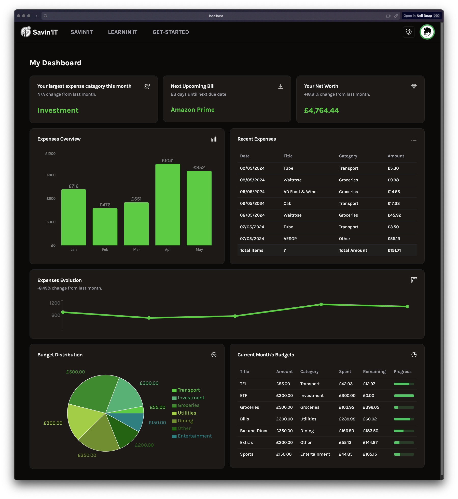
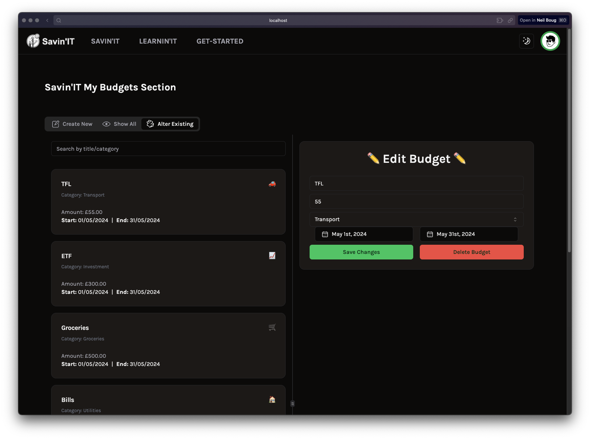
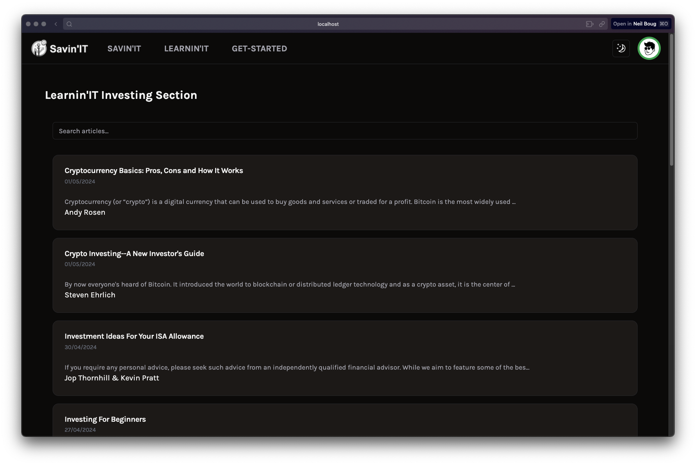
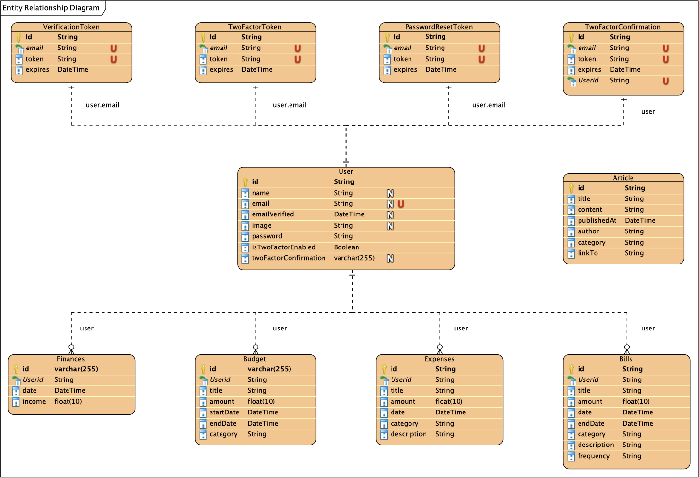

# 💰 Savin'IT – Personal Budgeting & Financial Literacy Web App

**Savin'IT** is a modern full-stack budgeting and expense-tracking web app designed to help users manage personal finances and build better financial habits. In addition to budget and transaction features, it offers an integrated **Learnin'IT** section with curated content to improve users’ financial literacy.

📍 [Live App](https://savin-it-final.vercel.app)

---

## 🧠 What It Does

- Track income and expenses by category
- Set and monitor monthly savings goals
- Visualise spending patterns with real-time charts
- Read financial literacy articles (Learnin'IT)
- Manage user accounts with secure authentication
- Receive email verifications via Resend API

---

## 🛠️ Tech Stack

```text
| Layer          | Tech                                       |
|----------------|--------------------------------------------|
| Frontend       | Next.js (React + TypeScript), Tailwind CSS |
| Backend        | API Routes (Node.js, NextAuth.js)          |
| Database       | PostgreSQL + Prisma ORM                    |
| Authentication | NextAuth.js                                |
| Emails         | Resend API                                 |
| Charts         | Recharts                                   |
| Deployment     | Vercel                                     |
```

---

## 🚀 Features

- 🧾 **Personalised Budget Planning**  
  Set goals and budgets, categorise expenses and track your progress.

- 📊 **Real-Time Analytics**  
  View interactive charts and summaries showing financial health.

- 📚 **Learnin'IT – Financial Education Hub**  
  Read handpicked articles and guides to boost your financial knowledge.

- 🔐 **User Authentication & Email Verification**  
  Secure login system with protected routes and email verification.

- 🌗 **Responsive UI with Theme Support**  
  Clean design with light/dark mode and mobile-friendly layout.

---

## 📂 Project Structure

```text
.
├── pages/                   # Route-based page components
├── components/              # Reusable UI components
├── lib/                     # Utility functions and helpers
├── prisma/                  # Prisma schema and seed scripts
├── public/                  # Static assets
├── styles/                 # Tailwind configuration
├── .env.example            # Environment variable template
├── README.md               # Project documentation
└── package.json            # Dependencies and scripts
```

---

## 📥 Getting Started

### 1. Clone the Repo
```bash
git clone https://github.com/neilboug/Savin-IT_FINAL.git
cd Savin-IT_FINAL
```

### 2. Install Dependencies
```bash
git clone https://github.com/neilboug/Savin-IT_FINAL.git
cd Savin-IT_FINAL
```

### 3. Configure Environment Variables
Rename `.env.example` to `.env` and add:
```env
DATABASE_URL=your_postgres_connection_url
NEXTAUTH_SECRET=your_secret_key
RESEND_API_KEY=your_resend_api_key
```

### 4. Set Up Database
```bash
npx prisma migrate dev --name init
```

### 5. Run the App
```bash
npm run dev
```
Visit http://localhost:3000

---

## 📸 Screenshots

- Dashboard overview
<p align="center">
  
</p>

- Budget setup & transaction logging
<p align="center">
  
</p>

- Learnin’IT reading section
<p align="center">
  
</p>

---

## 🗺️ Architecture Diagram
<p align="center">
  
</p>

---

## 🧱 Database Schema
<p align="center">
  
</p>
